# 教室で使えるかもしれないもの作り #◯ 「あと5分、なにしよう」がなくなる。1年生でも自分で読めるボードゲーム「パクパクゴブレット」

## 🏫 はじめに

授業が思ったより早く終わって、あと5分だけ、ぽっかり時間が空いてしまう。雨で外に出られない休み時間、教室がだんだん騒がしくなってくる。朝の会がはじまるまで、早く来た子が手もちぶさたで待っている。そんな短いすきま時間の使い道に、困ったことはありませんか。

そういうときに配れるものがあると助かるのですが、いざ探すと、なかなか条件に合いません。準備に時間がかかるもの、アカウントの登録が必要なもの、説明だけで5分終わってしまうもの。低学年だと、ルールの文章が読めなくて先生が読み上げることになり、結局こちらが張りついてしまう。

そこで作ったのが「パクパクゴブレット」です。3かける3のマスに駒を置いていく、1台の端末を2人で囲んで遊ぶボードゲームです。ブラウザで開くだけで、登録も、名前の入力もいりません。1回はだいたい2分から5分で終わります。

<https://gigayama.github.io/Gobblet/>

見た目は三目並べですが、駒に大きさがあります。大きい駒は小さい駒の上からかぶせて隠せる。この一つのルールだけで、勝ったと思ったところからひっくり返る展開が生まれます。ルールの説明は3行で足ります。

そして、画面に出てくる漢字には、ひとつ残らずふりがなを付けました。1年生でも、先生が読み上げなくても自分で始められるようにしたかったからです。

似たようなものは世の中にたくさんあります。それでも自分で作ったのは、既にあるものの多くが、遊ぶ前に何かを求めてくるからです。名前を入れてください。学年を選んでください。広告を閉じてください。すきま時間に配るものとしては、この一手間が重いと感じていました。開いた瞬間に盤が出ていて、押せば始まる。そこだけは譲らないつもりで作りました。

## 📱 このアプリでできること

開くと、いきなり盤面です。タイトル画面も、はじめるボタンもありません。すきま時間に使うものなので、開いてから遊びはじめるまでの手数はできるだけ削りました。

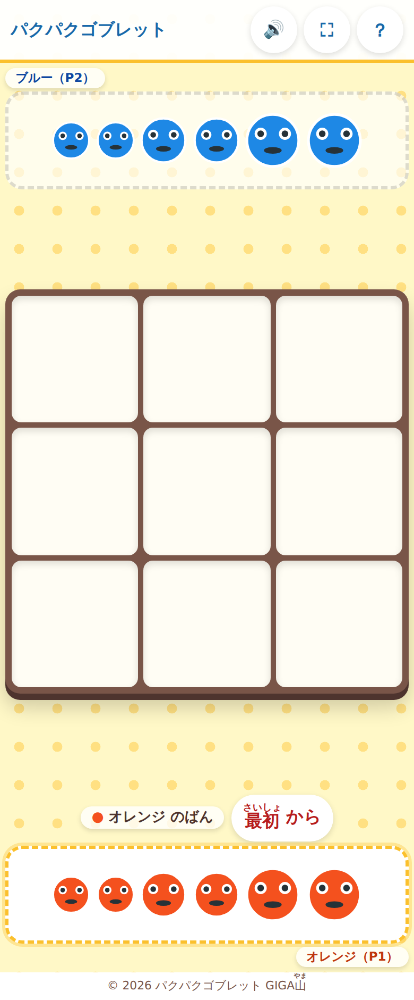

開いた直後の画面。上がブルー、下がオレンジの手持ちの駒です。

上と下に、それぞれの手持ちの駒が6つずつ並んでいます。小さいのが2つ、中くらいが2つ、大きいのが2つ。この6つが、その人の持ちものすべてです。今どちらの番かは、手持ちの駒を囲む枠が黄色く光ることで分かります。真ん中の下に「オレンジ のばん」と文字でも出ています。

1台を2人で使うので、どちらが押す番なのかがあいまいだと取り合いになります。色と文字の両方で出しているのは、そのためです。

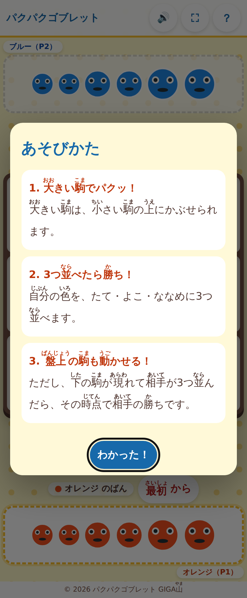

右上の「？」を押すと出てくる説明。ここも全部の漢字にふりがなが付いています。

遊び方の説明は3つだけです。大きい駒でパクッ。3つ並べたら勝ち。盤の上の駒も動かせる。右上の「？」からいつでも読み返せるので、途中で分からなくなった子は自分で確認できます。

操作は、自分の駒を押して、置きたいマスを押す。それだけです。駒を選ぶと、その駒を置けるマスに緑のふちが出ます。

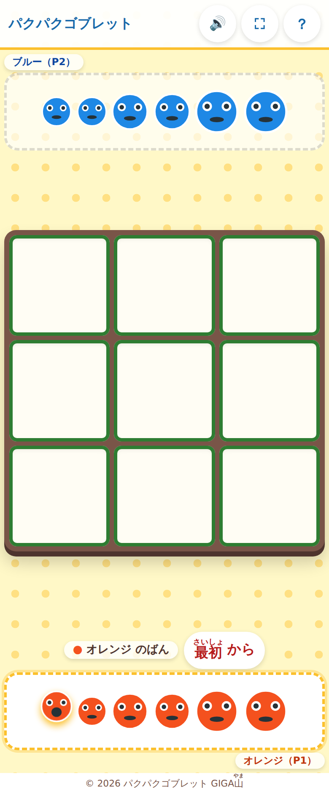

小さい駒を選んだところ。選んだ駒がぴょんぴょん跳ね、置けるマスすべてに緑のふちが出ます。

「どこに置けるんだろう」と考えて手が止まる時間を作りたくなかったので、置ける場所は選んだ瞬間に全部見えるようにしました。低学年でも、緑のところを押せばいい、と分かれば進めます。

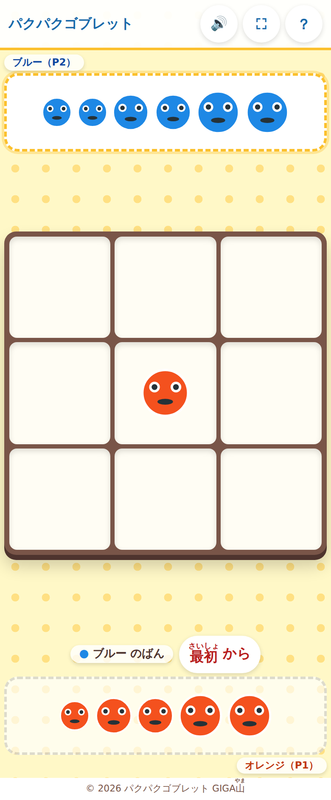

置くと同時に手番が移り、下のオレンジの枠から、上のブルーの枠に光が移ります。

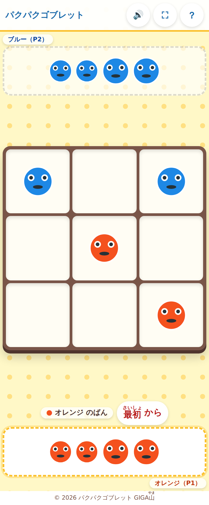

小さい駒を出しあった序盤。まだどちらも3つは並んでいません。

押しまちがえたときは、画面の下に短いことばが出ます。エラーの表示というより、次にどうすればいいかを教えるひとことにしました。

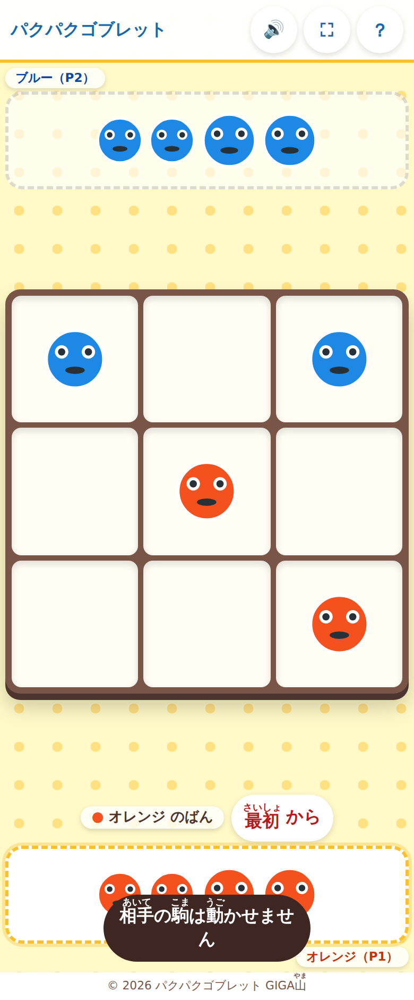

相手の駒を押したとき。ダメだと言うだけでなく、何がダメなのかが分かるようにしています。

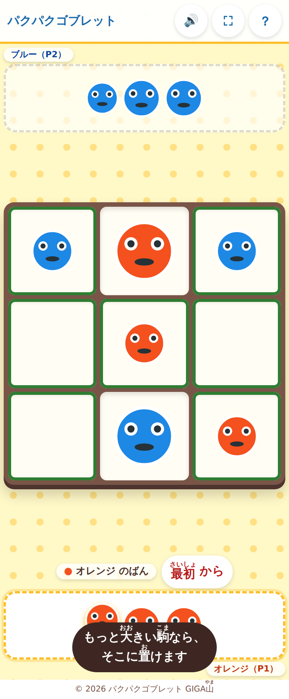

同じ大きさの駒にかぶせようとしたとき。「もっと大きい駒なら、そこに置けます」と、次の一手のヒントになる言い方にしました。

## 🧠 3つ並べるだけなのに、最後の一手でひっくり返る

三目並べは、慣れてくると引き分けばかりになります。先に覚えた子が必ず勝つようになると、負ける側はすぐに飽きてしまいます。このゲームに駒の大きさを入れたのは、そこを崩したかったからです。

大きい駒は、盤の上にある自分より小さい駒に、上からかぶせられます。相手の駒でもかぶせられます。だから、相手が「あと1つで並ぶ」というところまで来ても、大きい駒を持っていればその上からふさげます。

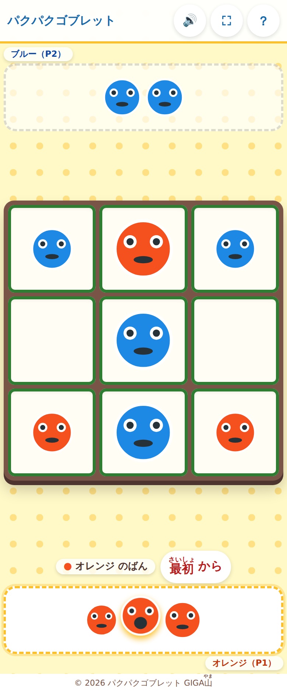

オレンジの大きい駒を選んだところ。ブルーの中くらいの駒が置かれたマスにも、緑のふちが出ています。ここにかぶせられるという意味です。

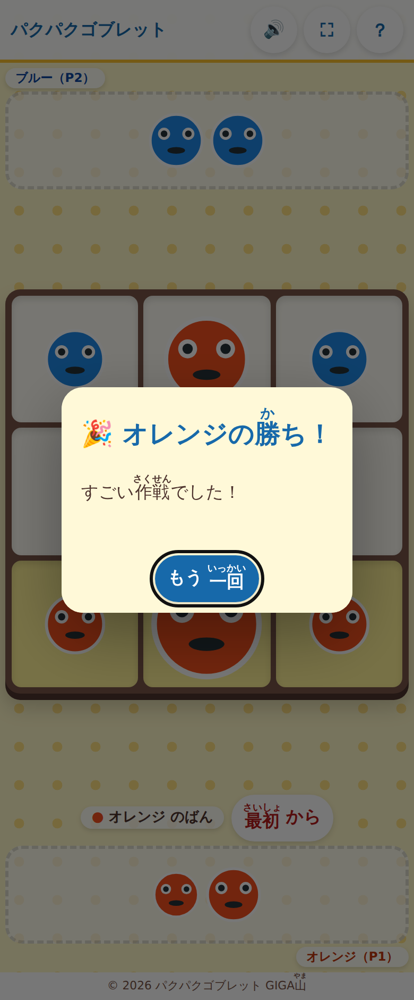

かぶせた瞬間に下の段が3つ並び、勝ちになりました。

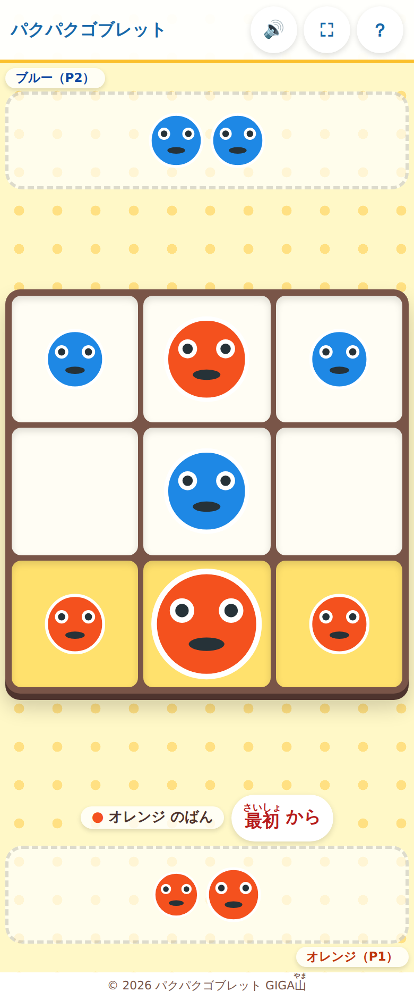

お祝いを閉じると、そろった3マスが光り続けます。どこで勝ったのかを子どもたち自身が確かめられるようにしました。

もうひとつ、手持ちの駒を使いきったあとの手があります。盤に置いた自分の駒は、別のマスに動かせます。

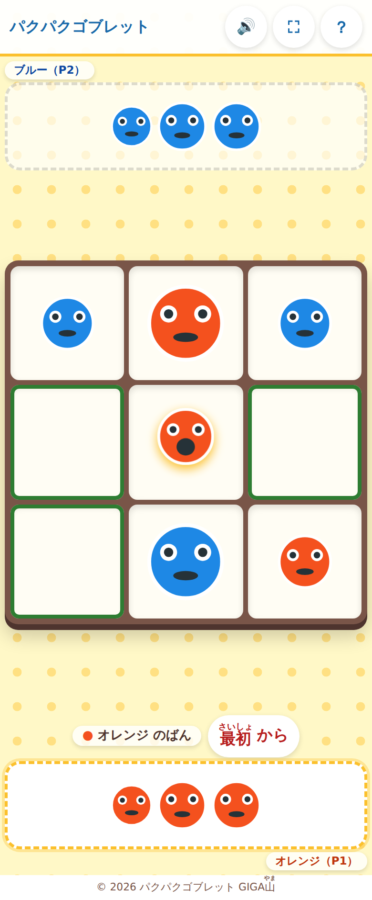

盤の上の自分の駒を押すと、その駒が跳ねて、動かせる先に緑のふちが出ます。

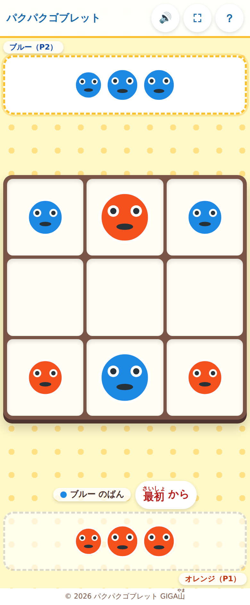

真ん中にあった小さい駒を、左下に動かしました。

ここに、このゲームでいちばんおもしろい落とし穴があります。かぶせるということは、下に相手の駒が隠れているということです。その上の駒を動かすと、隠れていた駒が顔を出します。それで相手の3つが並んでしまったら、その瞬間に相手の勝ちです。

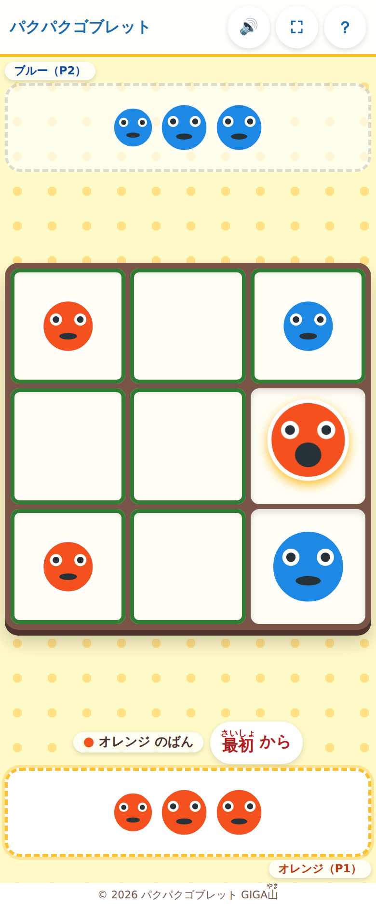

オレンジが、右の列にあるかぶせた駒を真ん中へ動かそうとしています。この駒の下には、ブルーの小さい駒が隠れています。

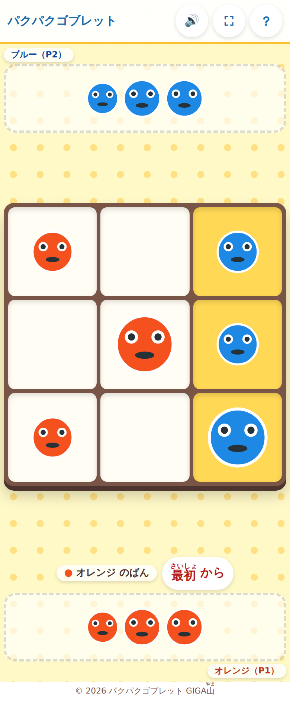

動かしたとたん、下から出てきたブルーの駒で右の列が3つそろいました。オレンジは自分の手で相手を勝たせてしまったことになります。

自分の駒を動かすときは、その下に何が隠れていたかを思い出さないといけない。ここが、このゲームを単なる三目並べから遠ざけている部分だと思っています。運の要素がなく、しかも短時間で終わるので、負けた子も「今の、こうすればよかった」とすぐ次に行けます。

盤は3かける3なので、そろえ方はたてが3通り、よこが3通り、ななめが2通りの、あわせて8通りしかありません。数が少ないぶん、どこが危ないかは低学年でもすぐ見えるようになります。それでも一本調子にならないのは、見えている駒の下にもう一つの盤面が隠れているからです。同じ8通りを見ていても、隠れている駒を覚えている子とそうでない子とで、まったく違う勝負になります。

手持ちは6つずつしかないので、置ききってしまうと、あとは盤の上をやりくりするしかなくなります。序盤に大きい駒を気持ちよく使い切ってしまうと、終盤にかぶせる手がなくなって守れない。この配分をどうするかが、何回かやっているうちに見えてきます。ここを言葉で説明する必要はなくて、負けたときに自分で気づくところだと思っています。

## 🔤 画面の漢字に、ひとつ残らずふりがなを付けました

低学年向けの教材でいちばんもったいないのは、内容は理解できるのに、画面の文字が読めなくて止まってしまうことだと思います。読めないと、結局そばにいる大人に聞くことになります。

そこでこのアプリは、画面に出るすべての漢字に、ふりがなを付けました。ボタンの文字も、説明の文章も、途中で出るひとことも、勝ったときのお祝いも、例外なく付いています。

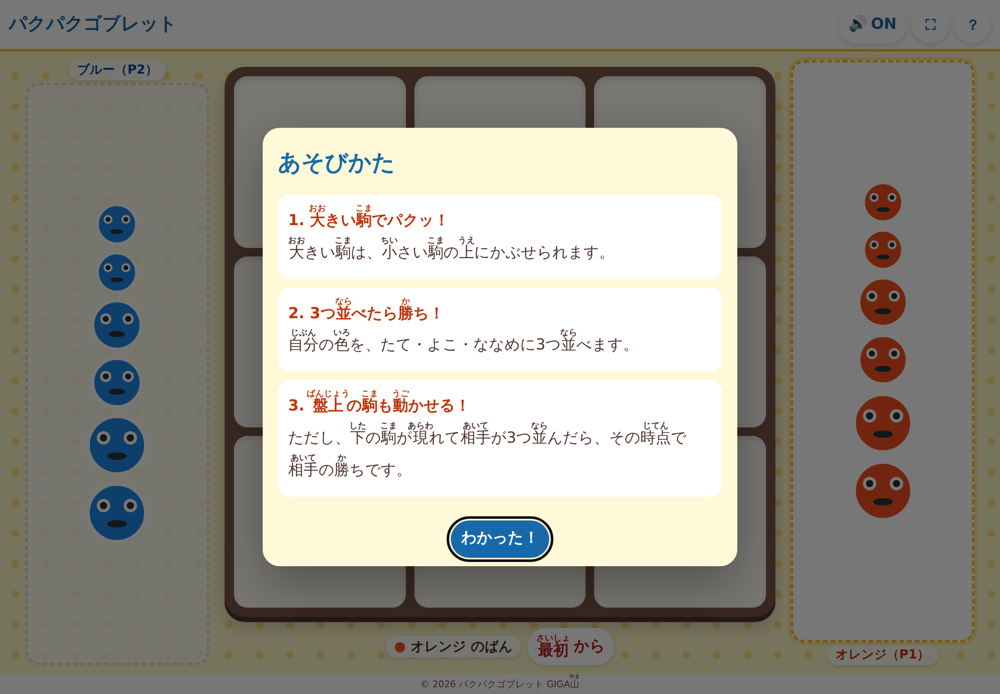

タブレットを横にして開いたところ。文章にもボタンにも、ふりがなが乗っています。

これは見た目の話だけではありません。読み上げソフトを使っている子には、ふりがなが二重に読まれてしまうと、かえって聞きとりにくくなります。そこで、画面には読みがなを出しつつ、読み上げには元のことばだけが渡るようにしてあります。「相手」を「あいてあいて」と読ませないための細工です。

漢字を減らしてひらがなだけにする、という手もありました。でも、ひらがなばかりの文章はかえって読みにくいですし、漢字とその読みが並んで目に入る回数が増えること自体に意味があると思ったので、ふりがなを選びました。文言を足すときにふりがなを付け忘れると、こちらの点検の仕組みが通らないようにもしてあります。

画面の大きさについても、横320ピクセルという、いちばん狭い部類の画面まで確かめました。

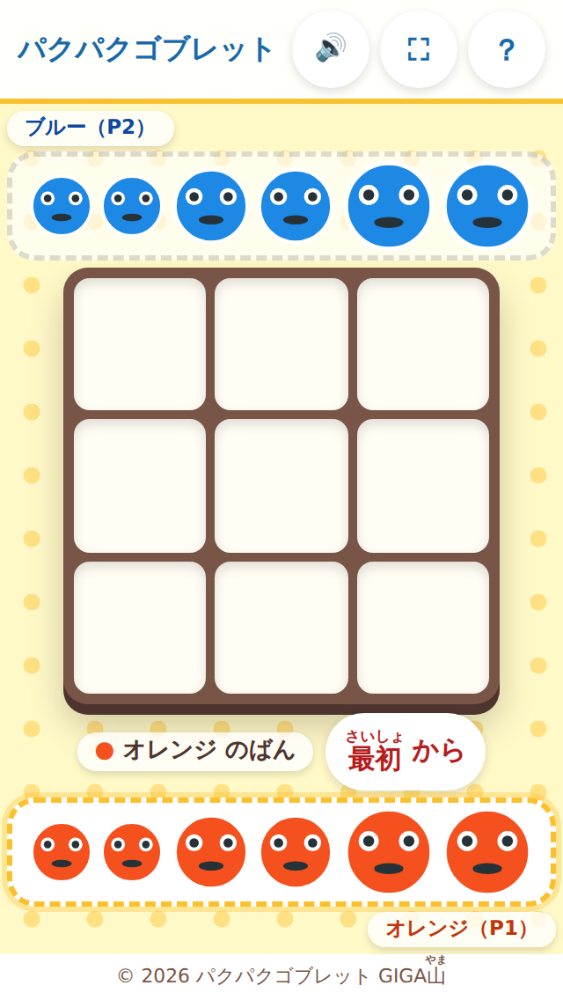

古い小さなスマートフォンほどの幅で開いたところ。横にはみ出さず、盤も切れずに収まります。

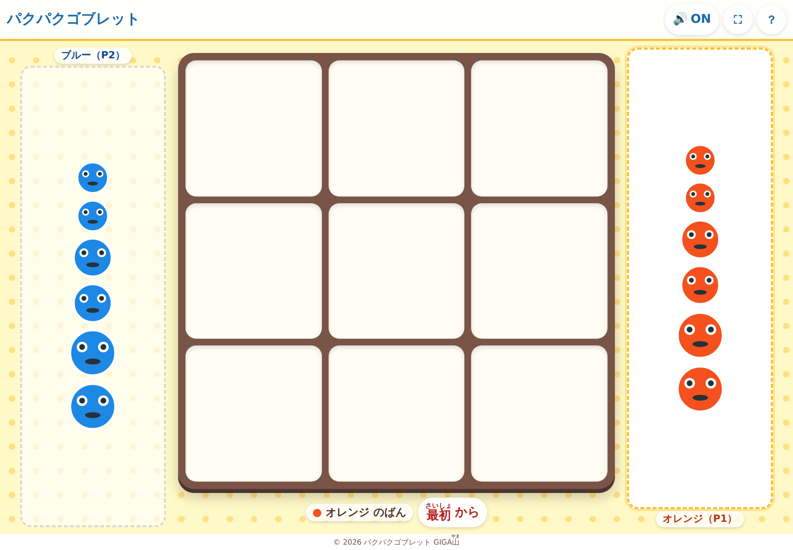

横向きにすると、手持ちの駒が左右に分かれます。1台を2人で向かいあって囲むときは、この形のほうが手が届きやすくなります。

駒の見た目は小さいままですが、押せる範囲は見た目より広く取ってあります。駒の大きさの違いはルールそのものなので大きくできない、けれど低学年の指では押しにくい、という両立のための工夫です。

## ✨ 導入のメリット

三つのいいことが期待できます。

一つ目は、すきま時間の手もちぶさたが減ることです。開くだけで始まるので、配る準備も、片づけも要りません。1回2分から5分で終わるので、あと5分という中途半端な時間にちょうど収まります。終わりの時間が読めるものは、こちらの気持ちも楽になります。

二つ目は、先生が読み上げ役から解放されることです。ふりがなが全部付いているので、1年生でも自分で説明を読んで始められます。先生がそばについて一語ずつ読み上げなくてよいぶん、うまく入れない子のほうに時間を回せるようになると思います。

三つ目は、導入の相談がすぐ終わることです。名前も出席番号も入力する場所がなく、成績も対局の記録もどこにも残りません。外のサーバーとやりとりする部分もないので、情報担当の先生に確認してもらう項目がほとんどありません。保護者への説明が必要な個人情報の取り扱いも発生しません。

## 🛠️ 【管理者向け】導入手順

情報担当の先生に聞かれそうなことを、先にまとめておきます。

校内のフィルタリングで許可がいるのは、次の1か所だけです。

- gigayama.github.io

このアプリは、自分自身のファイル以外を一切読みこみません。外部の部品置き場も、外部の文字フォントも、アクセス解析も、広告も入っていません。ブラウザ側の設定でも、自分以外との通信をすべて禁じてあります。ですので、許可するアドレスはこの1か所で足ります。

個人情報については、そもそも入力する場所がありません。名前、出席番号、メールアドレスのどれも聞きません。端末のなかにも何も書き残さないので、共用のタブレットで前の子の記録が次の子に見えてしまうことも起きません。ページを閉じれば対局の内容も消えます。

通信量も小さく収まります。最初の画面が出るまでに読みこむのは43キロバイト、アイコンや圏外用の画面まで全部あわせても103キロバイトです。40人が一斉に開いても、合計で4メガバイトほどです。校内のWi-Fiが混みあう時間帯でも詰まりにくいと思います。

インターネットにつながっている必要があるのは、最初の1回だけです。一度開いた端末は、そのあとつながっていなくても遊べます。

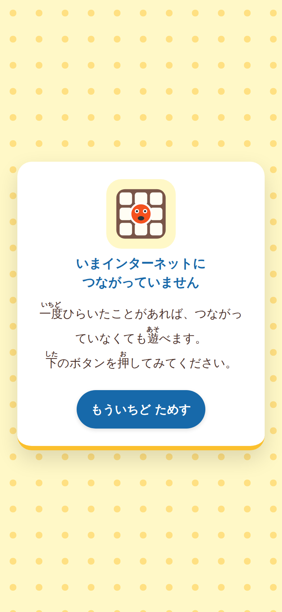

一度も開いたことのない端末で、つながっていない状態にしたとき。この画面が出ます。

端末に入れておくと、アイコンから一発で開けます。ChromebookやWindows、Androidでは、画面の右上に緑色の「インストール」ボタンが出ますので、それを押します。iPadとiPhoneではこのボタンが出ない仕組みになっているので、Safariで開いて、共有ボタンから「ホーム画面に追加」を選んでください。

iPadで使うときは、ホーム画面に追加しておくことをおすすめします。Safariには、しばらく開かないアプリが覚えているものを消してしまう仕組みがあり、ホーム画面に追加しておくとその対象から外れて動きが安定します。

電子黒板や大型提示装置に映すときは、右上の四すみのマークを押してください。画面いっぱいになり、盤と文字が大きくなります。

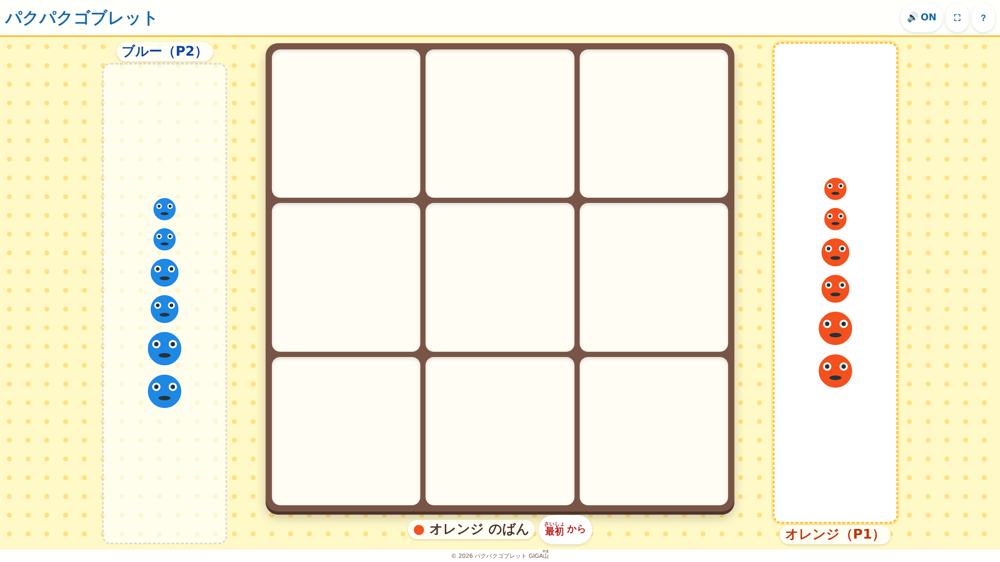

大きな画面に映したところ。教室のうしろの席からでも、どちらの色がどこにあるか見えるはずです。

このボタンは、フルスクリーンに対応していない端末では最初から表示されません。iPhoneのSafariが該当します。押しても何も起きないボタンを子どもたちに見せないための作りです。

新しい版を用意したときは、次に開いたときに画面の上に細い帯が出ます。

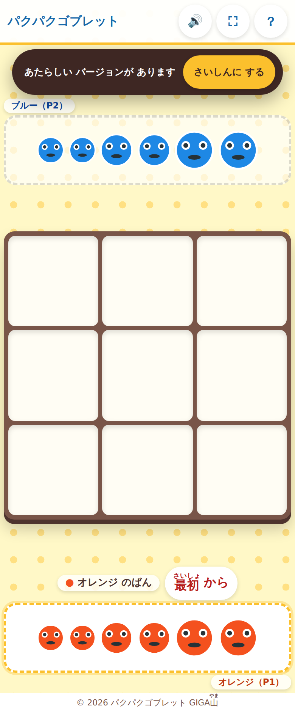

新しい版が用意されたときのお知らせ。押すまで切り替わりません。

この帯は、押したときだけ新しくなります。遊んでいる最中に勝手に切り替わって画面が作り直されると、対局が消えてしまうからです。帯が出ていても、そのまま最後まで遊んで大丈夫です。

つまずきやすいところも書いておきます。「インストール」ボタンが出ないという相談がいちばん多いはずですが、原因はたいてい3つのどれかです。iPadかiPhoneで開いている。すでに入っている。httpsではじまらないアドレスで開いている。この3つを順に確かめてもらえば、たいてい片がつきます。

直したはずのところが古いままに見えるときは、まず上のお知らせの帯が出ていないかを確かめてください。出ていなければ、ページを開いた状態でCtrlとShiftとRを同時に押します。iPadの場合は、アプリを一度終了してから開き直します。

音が出ないときは、右上のボタンが消音になっていないか、端末の音量とマナーモードのスイッチはどうか、の順に見ます。iPadは、画面をどこか一度押すまで音が鳴りはじめない仕組みになっているので、駒を1回押せば鳴りだします。

ふりがなを消して高学年で使いたい、という要望もあると思います。今のところは常に表示される作りなので、必要でしたらGitHubのIssueでご相談ください。学年に応じて切り替えられるようにできます。

## 📖 【利用者向け】使い方のガイド

子どもたちに説明するときの手順です。

1. <https://gigayama.github.io/Gobblet/> を開きます。アカウントもログインもいりません。
2. 1台の端末を2人で囲みます。上側がブルー、下側がオレンジです。向かいあうより、横に並んで座るほうが両方から押しやすくなります。
3. 手持ちの駒を囲む枠が黄色く光っているほうが、押す番です。まず「光っているほうの人が押す」と決めてしまうと、取り合いになりません。
4. 自分の駒を1つ押します。押した駒が跳ねて、置けるマスに緑のふちが出ます。
5. 緑のふちが出ているマスを押すと、そこに駒が置かれます。押す駒を変えたいときは、跳ねている駒をもう一度押すと選び直せます。
6. 相手の駒の上にも、自分より小さければかぶせられます。相手があと1つで並びそうなときは、この手で止められます。
7. 手持ちがなくなったら、盤に置いた自分の駒を別のマスへ動かせます。動かす前に、その駒の下に何が隠れているかを思い出してください。
8. たて、よこ、ななめのどれかに自分の色が3つそろったら勝ちです。そろった3マスが光ります。
9. もう一度やるときは「もう一回」を押します。途中でやめたいときは、盤の下の「最初から」です。

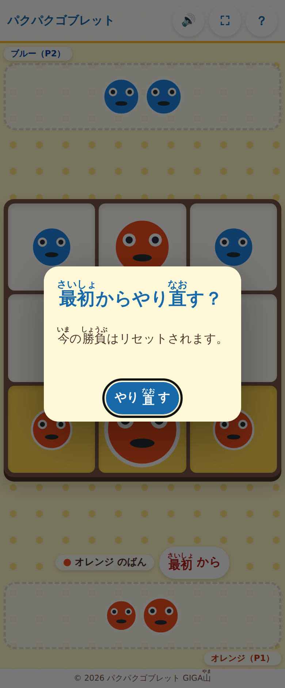

「最初から」を押すと確認が出ます。まちがえて押しても、対局が消えないようにするためです。

音を消したいときは、右上のスピーカーのボタンを押します。図書室のとなりや、他の学級が近い場所で使うときに便利です。

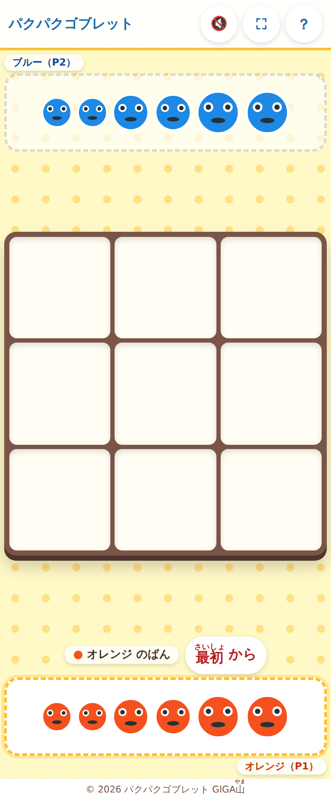

押すとスピーカーのマークに斜線が入り、OFFに変わります。

低学年に説明するときは、まず先生が1回、子どもたち全員の前で遊んでみせるのが早いと思います。大きい駒でかぶせるところを1回見せれば、たいていそこで伝わるはずです。電子黒板に映して、代表の子と先生で1局やってみせる形が、いちばん短く済むのではないかと考えています。

1台を2人で使うので、組ませ方には少し気を配ったほうがよさそうです。強い子どうしを組ませると長考が続いて時間内に終わらず、差がありすぎると片方がすぐ飽きてしまいます。ペアを固定せず、1局ごとに相手を替えていく形にすると、勝ち負けが一人に固まりにくくなると思います。1局が短いので、相手を替えるための待ち時間もほとんどかかりません。

端末が人数分ないときも、このゲームなら困りません。もともと2人で1台を使う作りなので、20台あれば40人が同時に遊べます。余った端末を電子黒板の代わりに使って、勝った組の盤面をみんなで見る、という使い方もできます。

## 📝 まとめ

このアプリは、機能を足すことよりも、削ることを考えて作りました。タイトル画面をなくし、ログインをなくし、記録をなくし、設定画面もなくしました。残したのは、盤と、12個の駒と、3行のルールだけです。

すきま時間に使うものは、準備に手間がかかった時点で使われなくなります。名前を入れさせるものは、それだけで導入の相談が一段階増えます。記録を残すものは、消し忘れの心配がついて回ります。だから、どれも作りませんでした。

そのぶん、ふりがなと、押せる範囲の広さと、どちらの番かの分かりやすさには手をかけました。ここが弱いと、結局そばにいる先生が呼ばれることになり、先生の5分は空きません。子どもたちが自分で始めて自分で終われることが、先生の時間を空けることにつながると思っています。

ICTを入れる目的は、効率化そのものではないはずです。先生の手が空いたそのぶんで、うまく入れずにいる子のとなりに座れる。すきま時間に教室のすみで一人になっている子に、だれかと組ませてあげられる。そういう時間が少しでも増えるなら、この5分の道具にも意味があると思います。

作ったものは全部公開してあるので、自由に使ってください。うまくいかないところや、こうしてほしいというところがあれば、GitHubのIssueに書いていただければ直します。

一歩踏み出そうとする先生を、私はいつでも全力で応援しています。
